## "讨贼檄文"回复?

> 恰好这几天头痛,偏偏看到了`wflow`作者发的声明,立马把哥们头痛治好了,看的我是快尿裤子了,我这里给你好好回复一下啊,一点一点回复.  
> 
## 商用版问题
>首先,并不是基于wflow做的,我不需要也没有必要给你说明相关信息,因为跟你一点关系没有,一句话,你管的太宽了未免.  
> 其实你应该不知道,我当时还基于`ruoyi`做了一个商用的简化版,售价500,后来不做了,最早加你群的应该都知道,我把里面的核心代码做到gitee了,为什么要放到gitee呢? 你接着往下看  

## 开源版问题 (论证)

### 前提:
> 我在2022年5~6月左右,加了一个Flowable学习群,群号<633 168 411>,群里面经常探讨工作流问题,在2022年5月15,因为当时我的流程设计器增加了很多个类型的节点,群里经常有人截图说 并行网关怎么解析?怎么找人的代码?  
> 然后后来 结识了Flowable群的那个 小白菜,后面所有关于开源版的事情,他都可以佐证,或者其他当时在群里面的人,    
> 2022年7-8-9月多点,群里各种人在问我的仿钉钉流程引擎后台代码怎么实现,此时距离我发商用版已经半年左右,但是当时所有的钉钉流程设计器都只有 审批人,抄送和条件分支,太简单了,后来你加了别的节点,但是当时你商用版还没做,所以我当时才在群里说,国庆之后开源出来(当时想的就是说把简化版开出来,不卖了),当时在群里面的人都可以看到,因为我这边11月手机电脑换了,所以没有当时的聊天记录了,  
> 不过这是个2000人大群,大家不用担心我在说假话,  
> 然后当时 `小白菜`说 他可以改造前台,我觉得实在让人免费做不太好,所以付给了他相关报酬.就开发了5天小晚上吧,也把wflow主要缺失的页面都补充了,(真正算完整工时不到2天)就写完了,然后10月17发gitee的,当时我还让群里人帮忙点star了    
> 这是前提,和你发商用版根本没啥么关系好吧..... 不知道你为什么要截这个图?别人家里出变故你觉得很好笑是不是????? 你格局小了!真的!,  

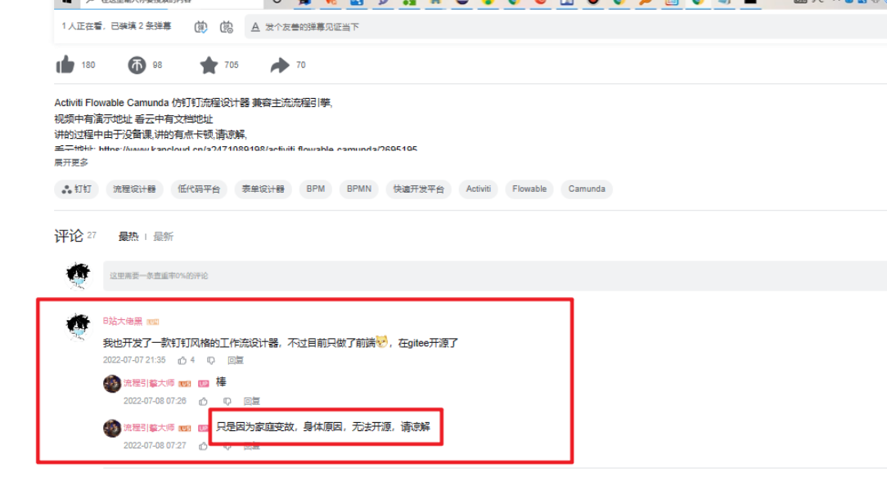
 
### 态度
> 既然是论证,我们就应该以客观角度来看待..  

## 具体论证  
#### 你的原话1  
  `wflow-web 项目于2020年(补充是2020年9月4号)提交，开源了钉钉风格的一款流程设计器，那时gitee 及 github还没类似项目，一直没什么人气，直到2022年7月份，作者对项目进行了完全升级重构后，逐渐进入大众视野，此为起因`  
> 反驳:    
> 1.怎么没有类似项目了,  
> https://github.com/StavinLi/Workflow ,这作者让你吃了?人家2019年11月12写的好吧  
> https://github.com/wxjaa/ddvue 这作者让你吃了?人家6年之前写的好吧.  
> https://github.com/SNFocus/approvalFlow.git 这作者让你吃了?人家2020年6月4号写的好吧  
> https://github.com/lc19970914/jquery-workflow 这作者让你吃了?人家2020年5月12号写的好吧  
> https://github.com/ue360/workflow 这作者让你吃了?人家2019年9月4号写的好吧  
> https://github.com/pxyi/workflow-vue/commits/master 这作者让你吃了?人家2020年7月7号写的好吧  
> 。。我都懒得提别的了.不要往自己脸上各种贴金...  

> 2.你自己也说了.2022年7月份进行了重构,你为什么重构你心里没数吗? 当时你的流程设计器或者是别人的就3个节点,一个审批,一个条件分支,一个抄送节点  
>  你7月07号看了我的视频,我视频里恰好提到了仿钉钉流程设计器的弊端,就是如果没有并行网关或者其他的,就很难实现一些复杂的流程,  
> 你听完就这么巧?听完就加上了??你项目出来2年不知道加,听完我视频后马上就加上,然后听完我视频里面说的idea ,然后做商用版了,搞笑呢?咱俩谁比较会把握时机啊?这都不算啥,我不和你计较,我懒得和你计较,(这玩意就是谁有能力谁就做?我是挡着你做了?)  

> 3.当时是看到你加了后面的几个节点,我才加的你的wx群,当时你都没做商用版好吧,你是才把前端补充好,我加进来之后,你慢慢做的,你咋不敢截那时候的聊天记录呢?  
> 哥们为什么要退,你心里没数? 做了个商用版,天天让别人给你测试,帮忙点点按钮,然后就是出一个进度就@全体成员..然后当时我还加了上述链接的第一个作者的群,然后当时我代码泄露了(这也是我开源的另一个原因),你恰好当时json转bpmn,写完了,  
> 说实话,我当时心里确实不相信你这么快就能写好(2个月左右差不多),所以在你群里,我还主动@你问了一个问题,我问你的是你的定时器节点是基于什么实现的,你说都是基于BPMN2.0的元素,这个时候我放心了,因为我的定时器不是基于boundaryEvent做的,后面我就没说过一句话了,和怕不怕别人怼我一点关系没有.(我是做啥亏心事了,我为啥要怕被怼?)  

#### 你的原话2  
`可能是一直没人买没什么名气，受到wflow从开源到商业化的启发，于是基于 wflow-web 和 lzgabel/camunda-bpmn-converter 进行了整合，`  
> 回复: `可能是一直没人买没什么名气`,这一点没有必要回答你,因为和你一点关系没有.  
> `受到wflow从开源到商业化的启发`   
> 回复:你是真的会往你脸上贴金啊,我呕了,感情是在你之前我没见过这种模式??,而且我商用版都不是基于你的做的,和你有什么关系呢?另外你的协议是Apache2.0协议?  
> 你懂不懂Apache2.0协议?我是没保留你的copyRight还是没保留版权还是没保留你的地址还是怎么的?,我特么连头像都保留你的,我特么连你的商用版文档,还有你的上面的微信都留着呢,我侵权侵个屁啊.那特么Flowable还是Apache2.0协议呢,我咋没见你用之前经过Flowable作者同意呢?  
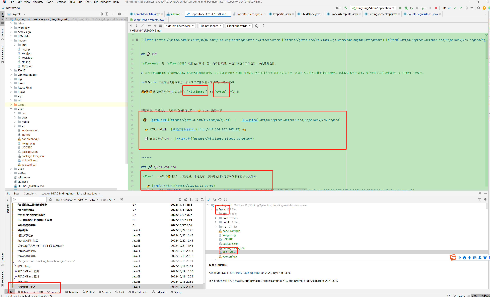
> 基于wflow-web (回复: 我是没这么写吗?)  
> 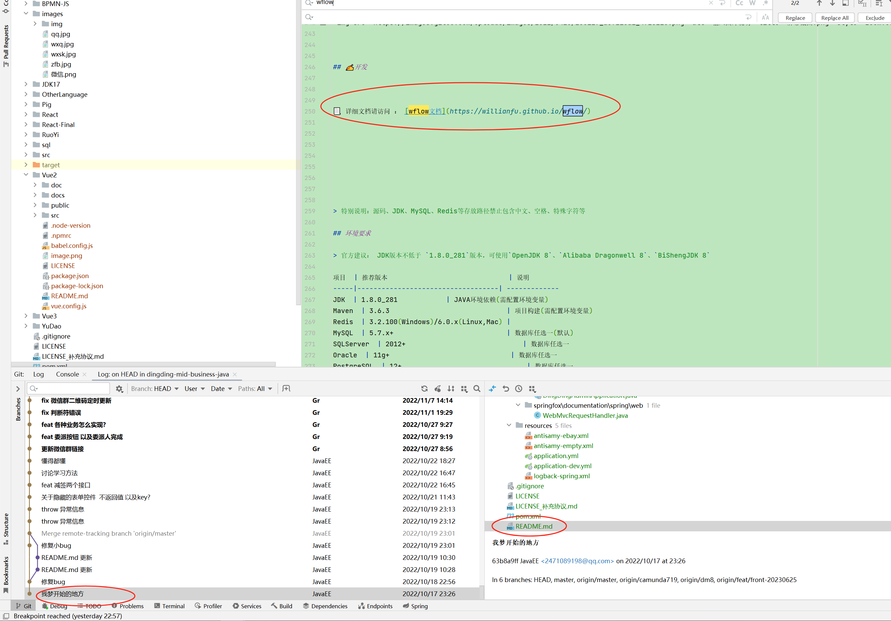
> 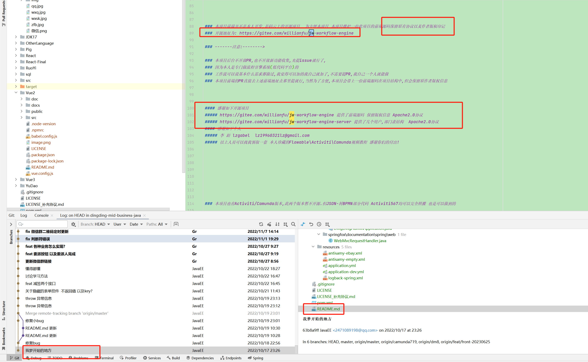
> 基于lzgabel/camunda-bpmn-converter(我是没这么写吗? 因为人家项目上没有LINCESE协议,按开源协议来算,没有LICENSE的项目是比任何协议都严格的),  
> 
> 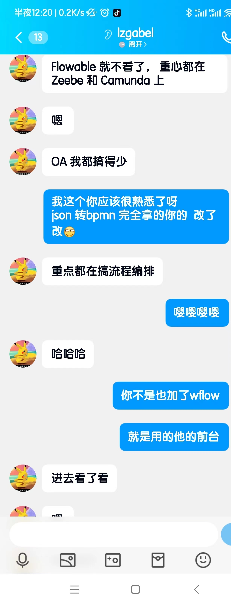
> 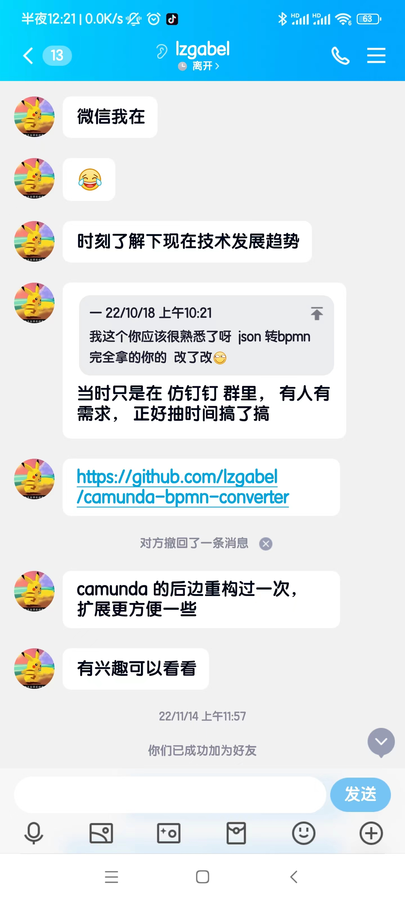
> 回复: 因为人家没有LINCESE,所以我第一次提交代码就说明了(后面会详细说),而且我还主动找了源作者问可不可以用,人家也同意了啊?  
> 是不是我问完作者,还得像你汇报一下????   

#### 你的原话3
> 这命名方式绝对是搜索引擎 SEO 专家，可以看出其深厚的功底，名字无所谓，关键字先统统来一波， 强 * 搜索引擎  
> 回复: 命名什么和你有个毛关系?我只要遵循gitee命名规则就行了,你是管的真特么宽,和你有p关系啊???这也得杠一下???要不去gitee总部掰扯一下?我的名字符不符合规范?  
> 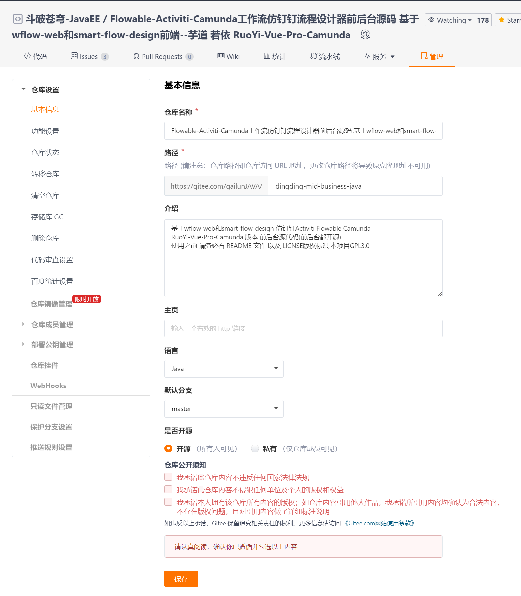

#### 你的原话4
> 大佬拥有其优秀的传媒能力，借助wflow 令人眼前一亮的UI设计及其堪比java之父余SJ的宣传手段迅速 积累一批粉丝，迅速吸引了需要wflow配套后端的那部分开源版的开发者，有了粉丝基础于是就开始逐渐膨胀  
> 总结来说就是，吹嘘自己贬低他人项目，属实是拿别人碗吃饭，顺便把他们家的锅也砸了  

> 回复: 你还是没懂你用的Apache2.0协议,我这里跟你好好掰扯掰扯  
> 你项目使用的是Apache2.0协议,此协议允许在保留原作者CopyRight的情况下分发软件, 比如 Flowable, Spring,SpringBoot 都是Apache2.0协议的 ,  
> Apache2.0协议允许声明补充协议, 但协议的补充协议不能超过Apache2.0的根本范围  
eg: 假设大学学校学生顶撞老师,学校给出结论说判处死刑?难道就真死刑了?最终肯定是以法律为准啊  
解释权不是由代码开发的作者决定的,是由你使用这个协议的基本范围决定的,如果你声明的界限超过了Apache2.0协议,那这有点双标  
为什么这么说呢? 因为  
用最严格的协议也就意味着名气不会很大,eg:很多人看到GPL3.0直接就不看代码了,直接下一个项目  
如果用越宽松的协议,用的人会更多,但是原作者的权益就越不好保证,  
  
> 请问我是违反了Apache2.0协议的哪一条?违反法律了吗?显然没有?违反道德了吗?显然没有,因为如果有的话,Flowable Camunda 也算盗版Activiti啊.,而且我也没基于你的做商用版啊?就值得你这么记恨????  
> gitee提交代码实现都在那摆着,我用你的项目 我全部说的都是 基于你做的,我违反个p的Apache2.0协议,  
> 而且最开始我连你的README都没有改动过 (包括你的微信号,你的商用版文档和地址包括所有),我特么纯纯在那给你引流呢,我说啥了?你项目1年没更新了,真以为star数那么高都是因为你的原因吗?  
> 敢不敢去你群@所有人问问,有多少人把我当成了你,有多少人是先看了我的项目,然后买你的代码的,有多少人是你的商业版有问题,然后过来问我的?别人给你无偿宣传,你给我1毛钱了???,你star数增速那么高,你给我1毛钱了?    
  
> 哥们对你的好,你是一点也不记挂啊, 说实话,你有什么资格过来指点我(首先我没有违反协议这一点,你就已经没有一点资格来过来指点我,不然就不要设置为Apache2.0协议,真以为协议是你说啥就是啥???,其他我做商用版跟你有p关系?而且我做的比你早好吧),  
> 享了别人的福转过头来骂我?到底是谁要砸谁的锅???  

>吹嘘自己贬低他人 ,回复: 放你娘的臭狗屁  
> 你说话是不是不看ContextHolder,我说前端简单我在每一讲里面都详细讲了,  
> 我说的是流程设计器分为两种 ,一种是基于那种jsplumb,mxGragh,g6,x6,svg 这种是可拖拽连线的,这种非常难,一般开发肯定搞不定,一种是钉钉样式的,width和height和x y都是撑出来的,都是固定的所以相对来说简单,  
> 你看我视频里面是不是这个原话,如果不是,我特么直接直播吃屎,你是把我的话当西北风,真的,门缝里看人把人看窄了,这上面哪个难,你心里没数?大家为什么要用钉钉UI的不用BPMN-JS的,大家心里没数???    

> 另外还有就是,你PDF也说了,我商用版价格比你的贵,都特么没钱买你的,能有钱买我的???你说话能不能客观一点??? 屁股决定脑袋呢?? 我看到你这句话我特么困扰几天的头疼瞬间不疼了  

> 值不值也不是你在这作为一个公开开源项目来贬低的，你用人家开源项目，还喷别人，你的道德在哪 里，跟你搞伪开源有什么关系？？？  
> 回复: 我咋贬低了?一个完整的脚手架也才4~5千,你这里面有什么代码就值4~5千了,信不信哥们对着你UI能把后台代码背出来?(背不出来我特么直播吃屎,我特么倒着背我都能背出来,倒背背不出来我也吃)   
> 我说句不值就是贬低了???你心理防线未免太低了吧?  问题是我说你的不值,难道后面说我的值了??? 显然没有啊 为啥说话一直带着有色眼光看人呢???  
>

> 远高于同类java开发？？？？，饭可以乱吃，话可不要乱讲.  最早做这块？，全国的企业开发类似流程系统前都要向你汇报工作吗  
> 
> 回复: 不好意思,哥们把github从第1页到第100页的和工作流相关的有用的代码全下载下来看过,没看到过一个对这些流程引擎封装深的框架,哪个不都是调调api? 我为啥敢说这话,我心里太特么有谱了,  
> 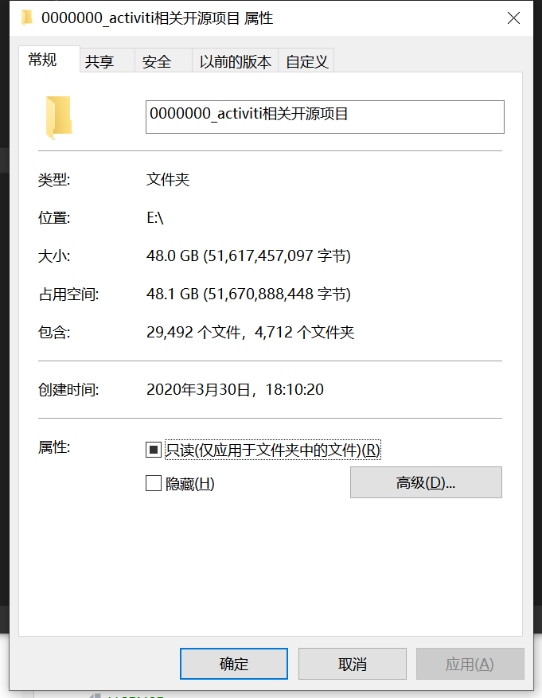   
> 我这个文件夹有100个G,里面多少个项目我就不说了,为什么文件夹这么大,因为我每个项目都运行过,产生了target文件夹,所以很大.你根本不知道别人为什么说远高于,就在这BB.  
> 就一个AgileBPM,人家写的非常好,但是可惜就是工作流代码没有开源,官方建议是反编译查看.  
> 最早做这块:那就只能从2010年Activiti封装出来开始,因为之前没有基于BPMN2.0的规范的框架,JBPM也不是,Activiit5.22我特么都玩烂了,我特么20年7月就在github写了一个Activiti5.22源码中文注释  
> https://github.com/LoveMyOrange/ActivitiSourceCode.git 哥们写这个源码注释的时候,你开源项目都还没开发呢.,你在这狗叫什么玩意.  
>  
#### 你的原话5
> readme抄袭 我觉得大佬的开源版文档有点像wflow-web项目，可能是readme直接cv，你是独立的开源项目啊大 哥！！  
> 回复: 基于你的为什么不能用你的呢???独立?独立个屁(上面已经详细说了),我特么一直说的基于你的, 特么一直在这给你引流呢,你在这狗叫  
> 有多少个开源项目fork ruoyi的?他们是不是都不能用ruoyi的文档和图片了??你到底是Apache2.0协议还是霸王协议?GPL协议都没有你这么霸道,恐怖如斯  
##### 注意
> 你首先理清楚一点,基于xxx开发 和 直接抹去xxx 然后copyright去掉,这种根本不是一个性质好吧.你显然把我当成后者了啊  
> 妈的隔壁cxygzl把你的前端代码抄走了,然后还基于你做了个收费版,还把你的copyright去掉了 readme连你提都没提, 咋没见你BB他呢?我好欺负是吧????还是见我B站粉丝慢慢比你多,你眼红了????  
> 而且我是死到你wflow上面了?人家别的Aapche2.0协议的钉钉都让我用(v3的,antd的,react的),就你不行了?如果不行,我建议你别设置为Aapche2.0协议,你直接给国际提交一个魂殿协议吧,我挺你,桀桀桀  
> 还有就是`erupt`用的不也是你的wflow,你还给他点star了,就因为人家是自研的流程引擎写的,就可以用是吧,我用就不行了?md,你是吧Apache2.0协议当成了个狗屁???你想咋解释就咋解释是吧???  
  
#### 你的原话6
> 官网抄袭: 之前是大佬是没有官网的，wflow 官网迁移以后，大佬也接着更新了官网，不能说像，简直巧了一个样,连官网建站选型框架都要抄吗?  

> 回复: 我特么笑嘻了,文档用的是什么技术?vue-press-reco,人家什么协议你没数吗?难道说你用了我就不能用了??你就这么霸道?和特么斗破苍穹的魂殿一样,是不是所有用了vue-press-reco的因为你用了,然后就都不能用了???  

>
#### 你的原话7
> wflow项目文档传送门：bpmn转换器 | wflow (willianfu.top),大佬文档传送门：后台基本原理&实现 | 仿钉钉飞书企业微信流程设计器 .直呼好家伙，你是真懒啊，连文档都懒得写，直接去人官网偷，大哥你偷错了，这是商业版文档  
 
>回复: 搞笑呢?我是把你的收费文档偷出来了还是把你需要花钱的文档偷出来的?在你的官网的东西,那就是你的,我也偷不走,是你写的就是你写的,哥们把你的copyright 以及你代码地址放到文档的第一行还不够显眼是吧???  
> 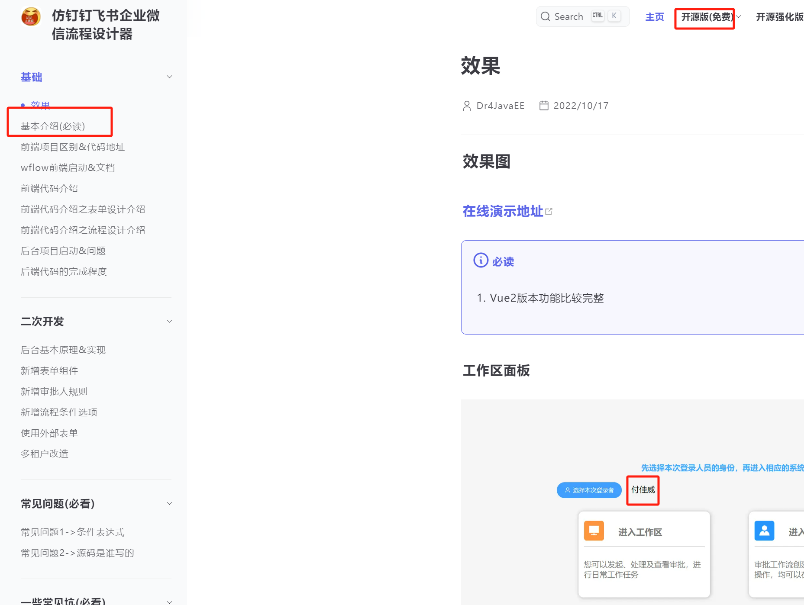
> 
> 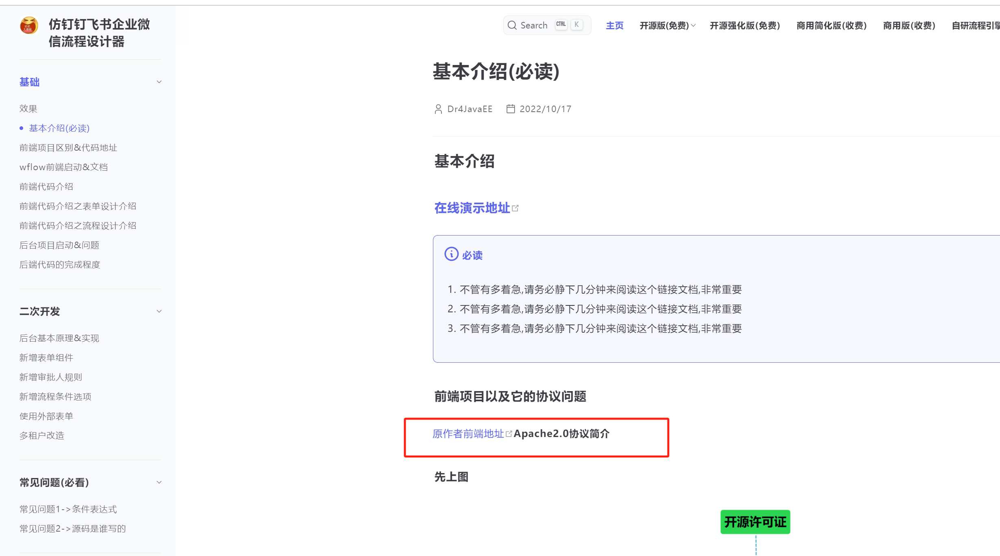

> 那些用代码的人都是憨憨??他们不知道通过我贴的代码地址找到你的文档????,你商用版付费文档我要是偷出来,那算我有问题,你看看ruoyi的付费文档我敢偷出来放进来吗???,问题是你的是公网对所有人可见的文档,而且我一直写的都是基于你开发的  
> 满篇没离了wflow一个字,你这就急了??? 是你商用版文档你就只对你商用版用户开放就好了呀? 你这算是开源版文档谢谢,  
> 最主要的是  
> 1:我没有靠你的文档盈利更没有通过你的项目获利,仅仅是推广你的项目,因为我并没有去掉wflow这个字眼, 如果我去掉了,这我无话可说,妥妥侵权,问题是我没有去掉,而且文档里面我一直都是把你的gitee地址是文档放在第一行,  

#### 你的原话8
> 熟悉大佬的朋友，应该了解大佬一直反复强调 json转bpmn这块才是项目的重点。大家可以自行比对，难道核心代码都是拿别人的? 然后他在官网也提了下作者，后面加上去的, 为何不把作者项目地址放出来，只感谢本人呢，是怕粉丝知道你连引以为傲的核心 json转bpmn 都是  
拿人家代码改的吗?  
> 
> 回复:
> 你真是tm让我笑嘻了!!!!,json转bpmn 哥们10月17提交代码的时候,第一次就把源作者id贴上了,而且10月17 还是18早上 (有截图,) 我主动和     李 銍 lzgabel  lz19960321lz@gmail.com  说了,人家也没说啥啊,我当时还把珍藏的视频给他了,  
> 而且源作者的注释,copyright,你看我去掉一点了吗???包括你的, 我看开源项目都是先看协议的好吧.你以为别人不懂协议???  
> 
> 其实文档上没有只写json转bpmn是重点,顶多算一个点吧,只是你没看到那个文档而已,哥们给你截个图  

> 另外,为啥不把源作者代码贴出来?当时源作者的1.前端是打了个dist 2,经常有人给我一段json让我转bpmn,我特么快吐了,3.条件表达式这块源作者缺失,4.很多钉钉流程设计器json结构不一样,不能复用,经常会有人以为JSON结构也是一样的,可以通用   
> 而且你是不是有逻辑上的误区,有一个完整的,为什么还要看简版的?其实很多人看这个代码之前,都知道这个是架子是源作者写的,因为大家基本都是从flowable大群过来的,而且很多人都在群里发过源作者git地址  

> 睁大你狗眼看看?我没提?还后提的???话张口就来是吧????真以为代码是拿过来就用的?,最主要是我经过作者同意了,轮到你在这里bb????,然后源作者让你当枪使把我踢出群,哥们我真是醉了快?  
> 怎么看你的代码提交时间你就知道查git了,这里你就说我后补的人家的名字??眼睛是不能睁开还是咋滴? 为了喷人,你简直无底线,,,,???  

> 问题是哥们也没见过你在群里发过这个git地址啊?(不管你用不用)我刚开出来,你第二天,才贴的他地址说让大家参考,到底是谁打的小999比较多呢???  

> 你这是啥你知道吗??你这是造谣,诽谤知道吗?按法律来说 可以告你诽谤罪  
> 
>
#### 你的原话9

> 对着wflow-pro商业版抄有意思吗，不能有点自己的想法主见吗？？？问题是大佬自己都没有意识到这 是抄，抄设计不是抄，f12扒别人接口返回数据可真棒 ？？？ 连菜单命名不会自己取名的吗，24个字你是一个不改啊（wflow之前是关于我的，后面更新为抄送）  发起审批抄袭，抄都抄不好  
> 
> 我就特别好奇,我是靠着你的盈利了还是咋的了,是把你wflow名字抹了??????, 我就是基于你做的,我为什么要改?码云基于xxx做的xxx多了去了?是不是都算抄袭?   
> 基于和抄 明明俩个性质好吗??在这胡搅蛮缠?????  
> 我是拿着你代码申请软著了???  
> 这么遭你记恨呢?  
> 我特么现在回想就两个字 ! 后悔  
> 1后悔当时在B站讲了个视频,让你看到了 2后悔用你的前端写了个简易版,然后大家看到我写的简易版,去买的你的商用版, 我真不知道你有什么不知足的,一边给你无偿推广,现在给你推广起来了,卸磨杀驴了知道  
> 好好想想你star数那么高到底是不是只有你的原因.哥们现在慢慢追上了,你急了,  
> F12扒接口: 你未免太高看你自己了 工作流接口,什么地方传什么参数,你是写了个多复杂的功能,看页面UI都知道怎么传,怎么反的,敢不敢约个直播,还是上面那句话,(哥们对着你UI倒背你的后台代码impl,背不出来我吃屎)  
> 发起审批: 开源版你连这个功能都没有,你给使用的人埋了多少坑??,我这个还是别人贡献的,都算抄了,我特么笑傻了.........  
> 
>
#### 你的原话10
> jsonflow是一款开源流程设计器项目，基于jsplmb插件实现，作者也已经做了声明，借鉴了plus项目并  重构了，后端为其自研流程引擎，与商业版隔离  
> 
> 回复: 哥们笑拉了,真的,你咋知道给你代码提交时间截个图? 你咋不知道他这句话啥时候补得???看看他这句话提交日期好吗?我人傻了.真的.当时还是我主动和lengleng说,后面这作者才加的,你一天啥不干,在这颠倒是非,我真的无感   
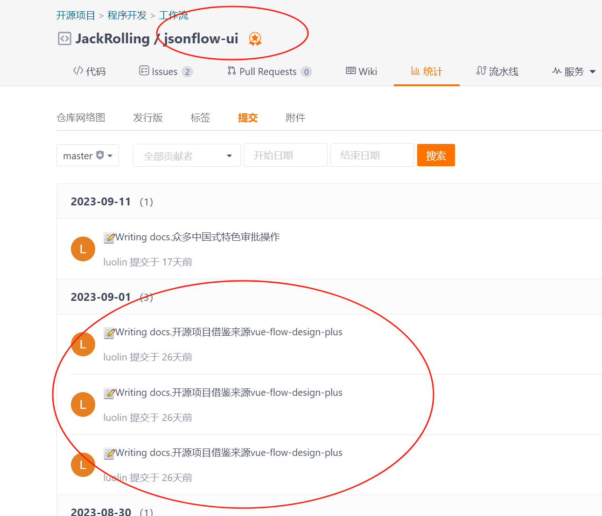
>
#### 你的原话11
> 你把wflow github json转bpmn缝合后声明为GPL,  
>
> 回复: 请问是违反你声明的Apache2.0了?还是违反你自己定义的魂殿协议了? json-bpmn上面已经说了,得到了源作者同意,你为什么还搁这BB赖赖,不清楚就在这BB.,难道你的不是Apache.20协议,是魂殿协议??桀桀桀?  

#### 你的原话12 
> vue-flow-design-plus是MIT协议，允许不做声明，基于它开发的项目也没毛病，作者项目上也很干净，没什么狗皮膏药之类的东西，商业版与pigx合作，作为其流程引擎部分。    
> 回复: 原话10已经不成立,还搁这洗 sb的要死感觉.   
> 
#### 你的原话13
> 插播一个八卦，大佬 之前找过 冷总想合作，冷总没看上，也是，毕竟冷总不会干砸自己招牌的事情 就那些牛皮癣式的风格文档，属实给pigx丢人   

> 回复: 纯纯诽谤,你这一点我已经可以报警了,我什么时候主动加过leng了,还主动合作?还leng没看上?   
> 说句题外话,我在2019 2020年(还没jsonflow什么事)的时候就给pigx录制过一些Activiti视频,后来家里确实出事了 当时郑州暴雨,家里冲塌了,没有再录了,一些人看了视频的联系过我,我还给他们发过受灾图片,后面也没有主动打扰leng,不信大家可以自己问   
>
#### 你的原话14
> 搞开源就好好搞，不要整的跟神棍一样，把自己吹的牛逼上天，在这捧自己踩别人，天天拿那个项 目来忽悠小白  
> 回复: 上面已经证实.既没有踩你,也没捧我自己,我甚至从来都没有在群里@所有人 推广过我的什么东西.  
>
#### 你的原话15
> 不要当缝合怪，少给粉丝画大饼，先把代码和项目质量搞起来，实话说，我们公司刚毕业的实习生 ,比你代码写的都规范。(咱们一会欣赏下你的代码和你的for循环查库)  
> 回复: 质量,你还好意思提.自己看看你写的什么玩意.我展开说说   
>  
> 流程设计->基础信息->消息通知方式  
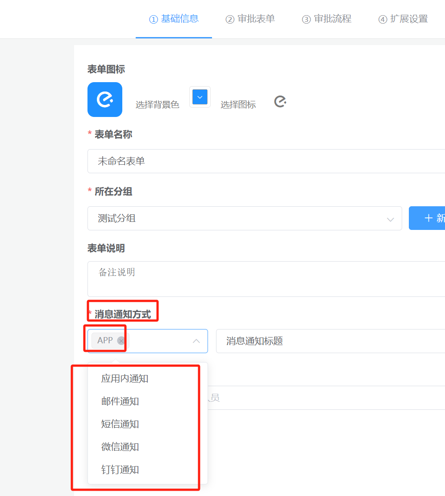 
> 什么都不选的时候 json结构 {"types":["APP"],"title":"消息通知标题"}  
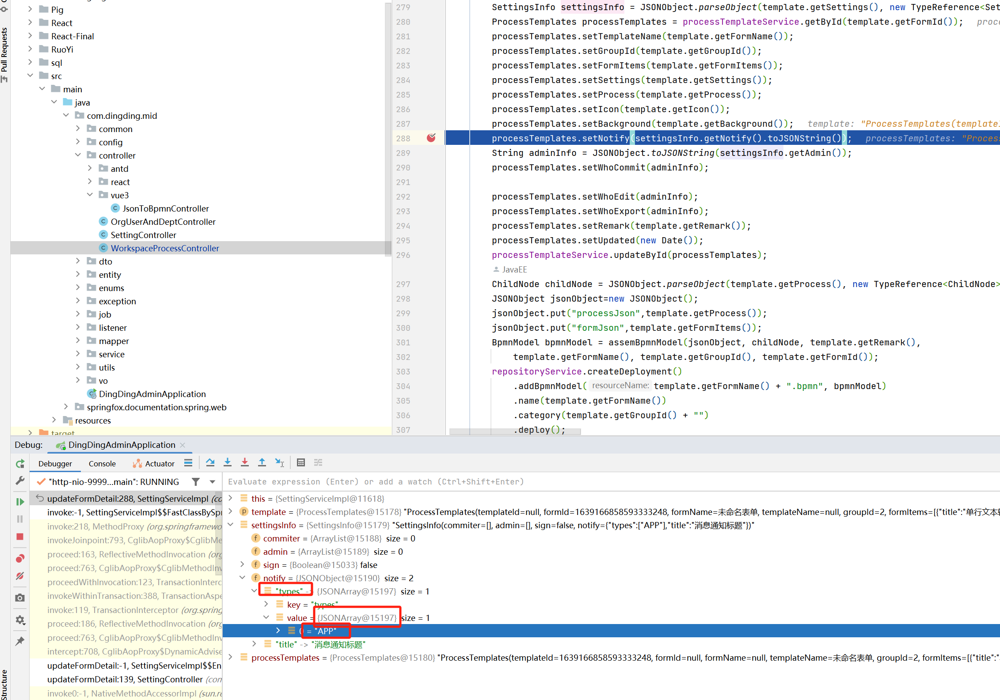
> 多选的时候 json结构 {"types":["APP",{"name":"应用内通知","type":"APP"},{"name":"邮件通知","type":"EMAIL"},{"name":"短信通知","type":"SMS"},{"name":"微信通知","type":"WX"},{"name":"钉钉通知","type":"DING"}],"title":"消息通知标题"}   
 
> 
> "APP" 这个字符串让你吃出来的? tm的, 一个都不选的时候  types 是 一个 List<String>接, 都选了,tm的List<String>根本接不了,只能用一堆Map<String,Object>接 ,mb的你真的会埋坑啊,  
> 数据结构都不会设计,能不能滚回去先学学,你大学老师教你这么设计的??  
> 有多少个地方是这样的,你心里没B数?,自己写一堆破烂代码.我特么快恶心死了,调的时候一堆jackson json转不过来的错,回过头一看,好嘛.一个集合里面又装Stirng 又装Map,  
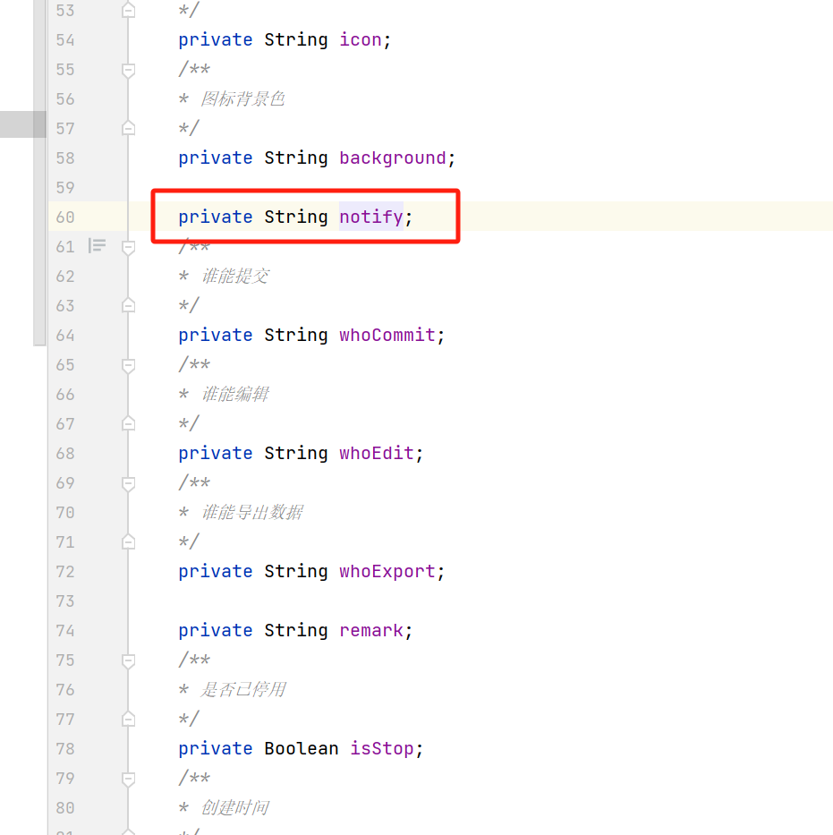
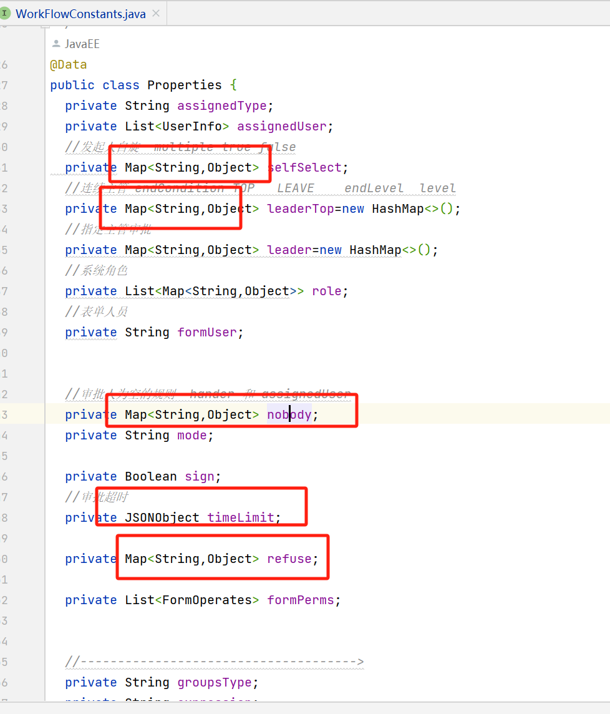
> 你以为为啥这里要用String 和 Map接,就你那个流程设计器JSON,搞得要么用string直接存,要么Map<String,Object>接, md,心里没点B数? 真会坑人啊?   
> 自己写一堆烂代码.我都懒得写好了.写的什么玩意??还在这道德绑架我,要求我????  
> 
>
#### 你的原话16 
> 把那些乱七八糟的内容去掉，你开源的那些东西都是各个项目提供的，本身基本可以说没什么原创，抄别人源码，抄别人的设计  
> 回复: 亏你写了后台,我条件表达式组装那块后台代码让你吃了是吧???,找人代码让你吃了是吧???审批人为空的操作让你吃了是吧???合着就看到一个json转bpmn了?? camunda找人代码让你吃了?ruoyi-vue-pro-camudna让你吃了??   
>

#### 你的原话17
> 在这项目流程构建这块，前端比后端复杂多了，在你的项目里面后端也就就那个bpmn转换的功能 ,写起来难点（还是拿别人的），前端包括流程图动态渲染，表单引擎设计渲染，流程进度动态渲 染，你看不懂就不要喷，只会显得你很没水平。   
> 
> 回复: 上面我已经回复了,钉钉这样的本来就比jsplumb的简单,这不是事实??你只是把这句话忽略了罢了,  
> 前端比后端复杂多了,为什么你不应该是先开源后台?前端收费???有本事就开出来  
> 就bpmn转换?搞笑呢? 仔细看看16点  
> 拿别人的?上面澄清了,经过作者同意了,轮到你BB了??  
> 哥们确实不会前端,我是没和前端讨论过还是咋滴?全世界就你会前端!  
> 
> 在看看你商用版写的什么玩意? 写的找人代码还写出找人性能问题了?(和那个cxygzl一样,都是对flowable了解个皮毛就开始了)  
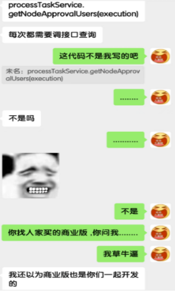
> 1.每个人初始化task的时候,调用一遍找人接口  
> 2.每个人点办理task的时候,再调用一遍找人接口  
> 合着就是配了20个角色,你代码里面得for循环调用20遍通过角色找人的接口是吧??然后每个人办一次再调用一下,有病?  
> 知道为什么当时你不会改这个问题吗?这不是自己写的for循环,因为你是用flowable机制实现的,所以你不知道这是个for循环,所以才会有这个问题,懂么???  
> md,你商业版用户问题都反馈到我这了,我tm快吐了,一天处理乌龙问题.就写那几个简单需求?卖5k??蒙人呢???? 说实话,和你的前端代码一样,UI看着好看 ,里面处理真的糟心,全是坑.  
> 

> 总结一下  
> 其实整体就是 因为你觉得我抄袭了你,你在这写小作文  
> 问题是:  
> 我是基于你写的,所以你上面的问题根本不成立,但凡我只要抹了你的copyright,100%是我的问题,但问题显然我没有  
> 最主要的是,我没有用你的代码盈利以及申请软著,首先并不是只用了你的代码.第二是,我是在遵循协议的情况下  
> 
> 第一是: 你不能以法律的名义觉得我做错了, 因为: 从头到尾没有侵犯你的名誉,并且还给你引流,给你创造收益,最主要:我没有申请软著还有基于你做商用版,因为这种代码说实话,我后台代码能有十几种方式来实现,不重复的,我有病我才去申请,申请不要钱???  
> 第二是: 你不能以道德的名义觉得我做错了, 因为:还是那句话,基于你写的,就是 `基于` 这两个字, 知道这俩词的含义吗? Apache2.0 协议最重要的就是这两个字,你恰恰给忽略了.真不知道你读书读到哪里去了  
> 第三是: 你不能以诽谤的名义觉得我做错了, 因为: 你在这妥妥造谣呢啊??知道 诽谤罪吗????  
> 
> 我只有一句话就是: 先看看Apache2.0协议的解释吧.  
> 
> 另外,我这一顿解释完,到底是谁在砸谁的锅??而且你不但是要砸我锅,你还是要毁我人啊?  
>  具体参照 你的原话8 和 你的原话13 ,到底是谁在乱说话  
> 
> 
> 说实话,你和cxygzl作者有一个共同之处  
> 名是你的,利是你的,名是他的,利是他的. 哥们就落一个臭名.我真笑拉了  
> 
> 看一下 诽谤罪的定义:  
> 诽谤罪是指故意捏造并散布虚构的事实，足以贬损他人人格，实施破坏他人名誉，情节严重，从而构成的犯罪。  
> 
> 我劝你尽早删除你说的那些话,并进行道歉..多的不说了,,,,,  
